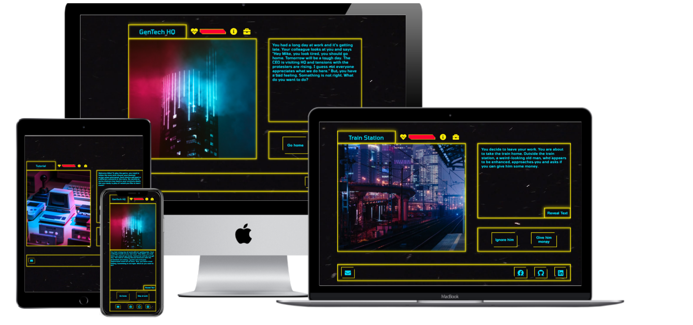

# Cyber Escape
This is an interactive game I created for Milestone Project 2 as part of the Code Institute's Full Stack Software Development course. I developed this project using HTML, CSS and JavaScript as the core technologies as well concepts and design techniques learnt in the Interactive Frontend module of the course.

You can view the live site [here](https://mikeavgeros.github.io/escape-game/)

## Table Of Contents

- [User Experience Design - UX](#user-experience-design---ux)
  - [Strategy](#strategy)
  - [Scope](#scope)
  - [Structure & Skeleton](#structure--skeleton)
  - [Surface](#surface)
- [Technologies Used](#technologies-used)
  - [Languages](#languages)
  - [Tools & Resources](#tools--resources)   
- [Testing](#testing)
  - [User Stories](#user-stories)
  - [Browser Compatibility](#browser-compatibility)
  - [Responsiveness](#responsiveness-1)
  - [Form Validation](#form-validation)
  - [HTML Validation](#html-validation)
  - [CSS Validation](#css-validation)
- [Future Features](#future-features)
- [Deployment](#deployment)
- [Credits](#credits)
- [Acknowledgements](#acknowledgements)

# User Experience Design - UX

## Strategy

My Milestone Project 2 from the Code Institute is a modern twist of the classic text-based choose your own adventure game. The story of the game will be displayed via the use of text and images. To progress through the levels and finish the game, players will have to choose the right action presented to them in the form of buttons. In order to make the game more interesting, players will have to fight enemies, pick items and weapons along their journey. They will also be able to view their stats and inventory at any point during gameplay.

I chose this type of game as it showcases a lot of object-oriented design patterns, primarily the use of classes and inheritance as well as being heavily interactive and data driven.

- ### User Stories

    - As a User, I want to be presented with a well-structured game, where I can easily find all the information that I need.

    - As a User, I want to be able to easily view information on how to play the game.

    - As a User, I want to be able to name my character similar to RPG games.

    - As a User, I want to be able to understand and enjoy the presented story.

    - As a User, I want the displayed images to convey the emotion and aesthetic of the story.

    - As a User, I want to be able to view my character's stats and inventory.

    - As a User, I want to be able to update my character's stats and use weapons to help me beat the enemies.

    - As a User, I want the UI to be consistent throughout the game, so it will be visually appealing and easy to play.

    - As a User, I want my actions to show different results to make the game more interactive and fun to play again and again.

## Scope

This project is developed as a Minimal Viable Product to with a short story and minimal features to showcase the style and concept. There will be room for future improvements and releases incorporating additional content and features.

- ### Current Features

	- Players can name their character.

    - Players can view their character's stats and inventory.

    - Images of each level and enemy are displayed on screen for increased realism.

    - Players can view a live displayer of their health in the form of a health bar to check if they are about to die.

    - Players can view the remaining health points of each enemy so that they know if they can beat them.

    - Players can contact the developer with questions and story suggestions as well as view their social media and github accounts.

    - Animations are added when displaying the text and buttons.

    - Players can choose to skip the text animation in order to play faster.

    - Players can choose to view a tutorial which explains the functionality of the game or start playing right away.

    - A video plays on a loop in the background which adds more movement and realism to the game.

- ### Future Features

    - I would like to complete the story and present players with more than 2 options each time in order to create a more complex narrative with different endings.

    - I would like to use session storage to save the state of the game so that you do not start from the beginning. This was not currently implemented due to time constraints and because the story is short.

    - Since the functionality to pick weapons which update the player's stats exists, I would like to create more weapons and special items for the player.

    - I would like to add icons next to the items in the inventory similar to RPG games.

    - Add the entire story, levels, items and characters into a JSON file, which can be replaced so that anyone can mod the game and add their own story, characters and items.

## Structure & Skeleton

I have designed the structure and layout of my game based on the CSS grid system. I have created low fidelity wireframes for desktop and mobile using Miro in order to guide me in designing the game. The design and layout of the game has evolved from the original Miro wireframes. You can view the original low fidelity wireframes below.

-  ### Wireframes
 
	**Desktop**
    
    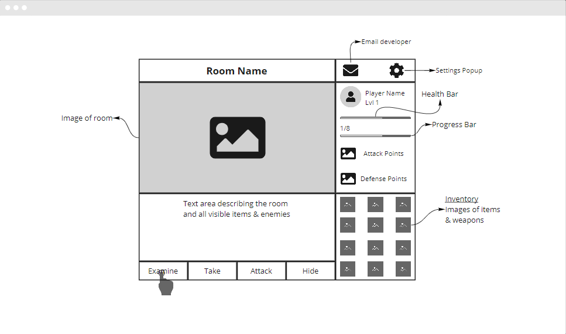

    **Mobile**

    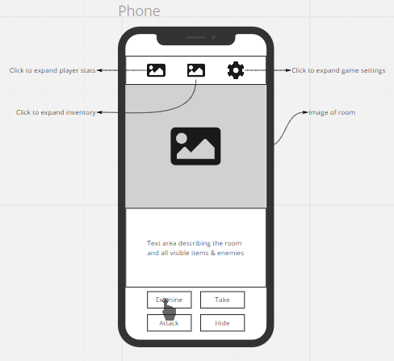

## Surface

-   ### Colour Scheme

    -   The main colours used are black, yellow, cyan and red. The reason I chose these colours is because it adds a cyberpunk feel to the UI, which is the main concept of the game.

    -   Black is used for the background together with the video.

    -   Yellow is used for the borders of my HTML elements and some of the icons. 

    -   Cyan is used for all the text and some of the icons.

    -   Red is used for the main headings and hover effects of the buttons.

-   ### Typography

    -   I have used [Google Fonts](https://fonts.google.com/) to import the fonts for the website.

    -   The font that I imported is Tomorrow and the weight is 400 (Regular). I have used this font as it makes the design look more futuristic and cyberpunk which is the main concept of the game.

    -   Sans Serif is used as the fallback font in case Tomorrow is not being imported into the site correctly.

    -   I am using fluid font sizes that grow together with the viewport width. This is achieved by using the clamp attribute and setting a fixed min and max size and a fluid desired size with the help of the viewport width unit (vw).

-   ### Images

    -   I have used [Unsplash](https://unsplash.com/) to source all the images of the game. You can find more information on the Credit section.
    
-   ### Icons

    -   I have used [fontawesome](https://fontawesome.com/) to source all the icons used in the game.

-   ### Structure & Layout

    -   Due to the simplicity and nature of the project, I decided to create a single-page game as it created a smoother user-experience with an easier and more effective layout.

    -   CSS grid was used to structure the game as it allowed me to easily place all the elements in the page and make them fully responsive without the use of bootstrap.

# Technologies Used

## Languages

-   [HTML5](https://en.wikipedia.org/wiki/HTML5)

-   [CSS3](https://en.wikipedia.org/wiki/Cascading_Style_Sheets)

-   [JavaScript](https://en.wikipedia.org/wiki/JavaScript)

## Tools & Resources

1. [VS Code](https://code.visualstudio.com/)
    -   VS Code was my IDE of choice for writing the HTML, CSS and JavaScript code.

2. [Google Fonts](https://fonts.google.com/)
    -   Google Fonts was used to import my fonts of choice into CSS for use throughout the website.

3. [Font Awesome](https://fontawesome.com/)
    -   Font Awesome was used to add icons to the website for aesthetic and UX purposes.
    
4. [Git](https://git-scm.com/)
    -   Git was used to help me manage and keep track of my source code history.

5. [Sourcetree](https://www.sourcetreeapp.com/)
    -   Sourcetree simplified and visualized my interaction with the Git repository.

6. [GitHub](https://github.com/)
    -   GitHub was used to store and manage the Git repository.

7. [Miro](https://miro.com/app/dashboard/)
    -   Miro was used to create the [wireframes](https://miro.com/app/board/o9J_lG5rLBo=/) during the design and prototyping process.

8. [Chrome DevTools](https://developers.google.com/web/tools/chrome-devtools)
    -   Chrome DevTools helped me debug issues that I've had during development. In addition, by using the inspection mode I could see how responsive my game was.

9. [W3C Validation Services](https://validator.w3.org/)
    -   W3C Validation Services were used to help me check if my HTML and CSS code has any errors and it adheres to the standards. More details in the Testing section.

10. [JS Hint](https://jshint.com/)
    -   JS Hint used to help me check if my Javascript code has any errors and it adheres to the standards. More details in the Testing section.

11. [Am I Responsive](http://ami.responsivedesign.is/)
    -   Am I Responsive was used during my testing phase to check the responsiveness of my game.

12. [Techsini Multi Device Mockup Generator](https://techsini.com/multi-mockup/index.php)
    -   Techsini Multi Device Mockup Generator was used during my testing phase to check the responsiveness of my site.

13. [CSS Minifier](https://cssminifier.com/)
    -   CSS Minifier was used to minify my CSS file in order to improve loading speed and performance.

14. [WAVE Web Accessibility Evaluation Tool](https://wave.webaim.org/)
    -   WAVE Accessibility Evaluation Tool was used to help me make my content more accessible to users with disabilities.

15. [Email JS](https://www.emailjs.com/)
    -   Email JS was used to enable users to send emails to the developer.

# Testing

## User Stories

- As a User, I want to be presented with a well-structured game, where I can easily find all the information that I need.

    - As a User, I want to be able to easily view information on how to play the game.
        - This was achieved by starting the game with a tutorial scene thoroughly explaining the functionality of the game.

    - As a User, I want to be able to name my character similar to RPG games.
        - The game allows the player to name his character before starting the game. In addition to that the story calls the character by his chosen name, which adds to the quality of the game.

    - As a User, I want to be able to understand and enjoy the presented story.
        - The story is carefully structured and tested. Each option displays a different outcome. Some option may lead to a gameover so there's the added tension of choosing the right action.

    - As a User, I want the displayed images to convey the emotion and aesthetic of the story.
        - Images for both the scene and the enemies are displayed on screen together with a name. This adds more realism to the game and makes the players more engaged.

    - As a User, I want to be able to view my character's stats and inventory.
        - Players can view their character's name and stats by clicking on the info icon. The tutorial scene explains that functionality.

    - As a User, I want to be able to update my character's stats and use weapons to help me beat the enemies.
        - The code currently has functionality to updates the player's stats although since the story is short, we do not have many weapons. The only case in the current game of a special item updating the character's stats is when you use the special spray to update your health.

    - As a User, I want the UI to be consistent throughout the game, so it will be visually appealing and easy to play.
        - The UI is consinstent with the cybepunk vibe of the game. The UI is consistent across multiple screen sizes and devices. The UI has been thoroughly tested and does not have any glitches or bugs.

    - As a User, I want my actions to show different results to make the game more interactive and fun to play again and again.
        - Each choice in the game leads to a different outcome. Some choices may lead players to play more or less chapters which creates an excitement for players when they play the game for a second time and see an entire new scene which they never played before.

## Browser Compatibility

-   The game is compatible with most modern web browsers. For the best viewing experience, I recommend using Chrome, Firefox, Edge or Safari. 

-   The worst viewing experience is on Internet Explorer. I decided to not include any vendor prefixes for IE or make any changes to my code as IE is no longer supported. 

## Responsiveness

Since I haven't used Bootstrap, I have been constantly testing how responsive my website is by using [Google Development Tools](https://developers.google.com/web/tools), [Am I Responsive](http://ami.responsivedesign.is/) and [Techsini Multi Device Mockup Generator](https://techsini.com/multi-mockup/index.php)

-   ### Google Development Tools

    Throughout the development process, I have been consistently testing that my game and all the popups work well on different screen sizes and devices. 

    -   This has helped me adjust the values on my font sizes so that my fonts are responsive and work well with all screen sizes.

    -   This has helped me adjust the grid column and row parameters so that all the nested elements respond and adapt to the screen size of the viewport.

    -   This has helped me adjust the width and height of all my images.

    -   This has helped me adjust the width and height of my buttons as their size is responsive depending on the screen width.

    -   Overall, most of the elements on the website are responsive based on the screen size so being able to view how the game adapts depending on the screen has helped me make suitable decisions, which have improved the UX of the game.

    -   During the testing phase, I have used Lighthouse to generate reports for both Desktop and Mobile. The reports showed better practices and syntantical fixes on my HTML and CSS, which in turn helped boost the performance, accessibility and UX of the game. You can view the final results below.
        
        **Desktop**
        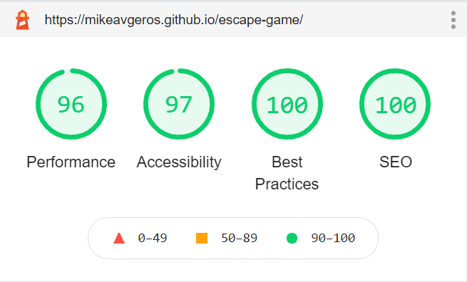

        **Mobile**
        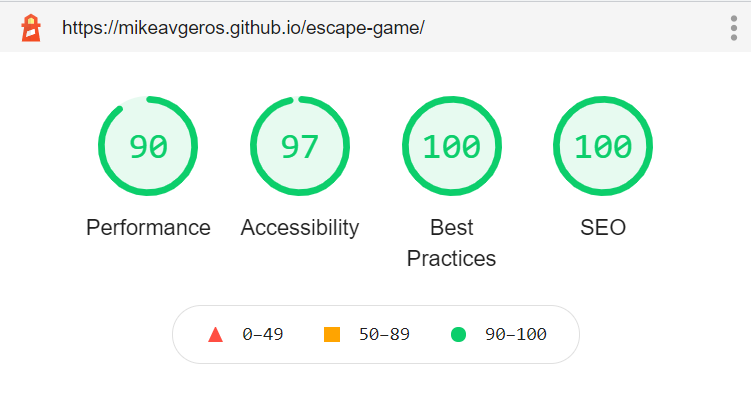

-   ### Am I Responsive?

    -   During the testing phase, I ran further tests on my site's responsiveness using the Am I Responsive website. This has helped me identify some size-related inconsistencies that were not so visible with Google Development Tools.

-   ### Techsini Multi Device Mockup Generator

    -   During my testing phase, I also ran further tests on my site's responsiveness using the Multi Device Website Mockup Generator on Techsini. I then compared my findings with the mockups from Am I Responsive. You can view the mockup below.
    

## HTML Validation

The [W3C Markup Validator](https://validator.w3.org/#validate_by_upload) was used to validate every page of the website to ensure there were no syntax errors in my HTML. It passed the validation without any errors.

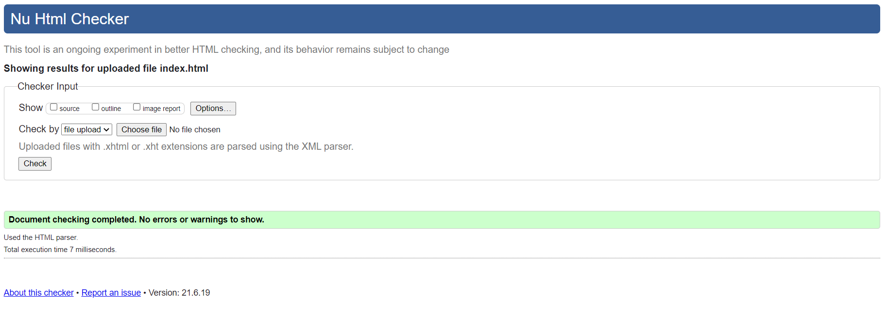

## CSS Validation

The [W3C CSS Validator](https://jigsaw.w3.org/css-validator/#validate_by_upload) was used to validate every page of the website to ensure there were no syntax errors in my CSS. It passed the validation without any errors.

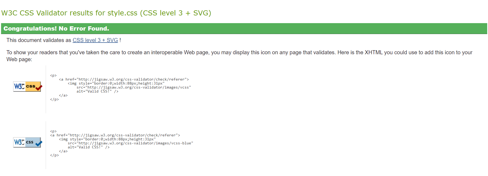

## Javascript Validation

[JS Hint](https://jshint.com/) was used to validate all my Javascript scripts. All scripts passed the tests without any errors. The main warning was about unused variables which were the class declarations.

You can view all the tests below.

**gamemanager.js**

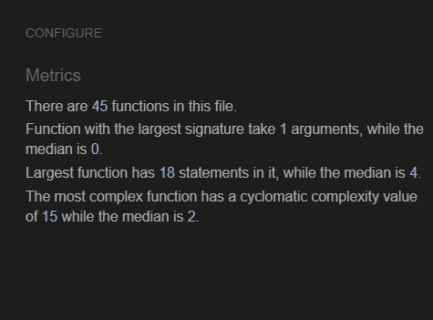

**story.js**

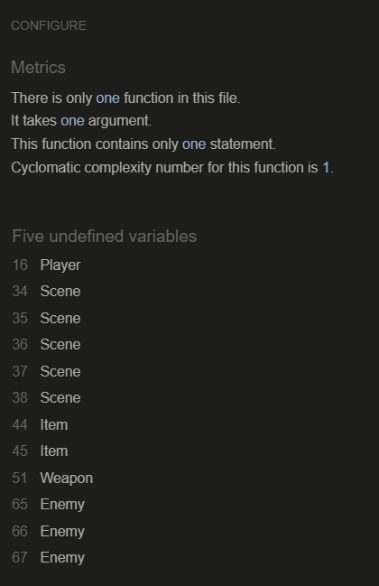

**email.js**

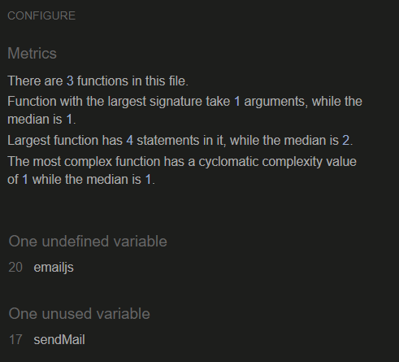

**character.js**

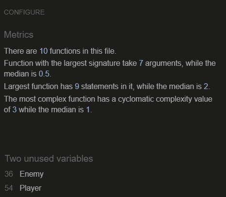

**scene.js**

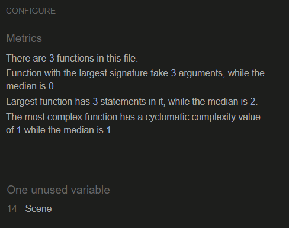

**item.js**

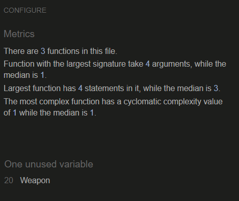

## Accessibility

The [WAVE Web Accessibility Evaluation Tool](https://wave.webaim.org/) was used to test the accessibility of my website. It identified missing ARIA-related attributes (especially in my navigation menu icon) that helped me improve the accessibility of the site for Users with disabilities. The final results, which you can view below indicate no errors.

## Form Validation

-   I made sure to validate my forms and ran suitable tests using different input scenarios. I can confirm that all of them behaved as expected. 

-   I have tested that my required input attributes behaved as expected and warned users to fill the required fields.

-   I have tested that the submitted form is being sent to my email address containing all the information added by the user.

You can view screenshots of the tests below.

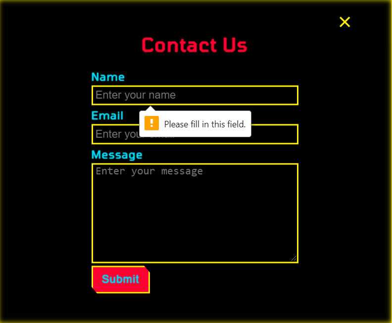
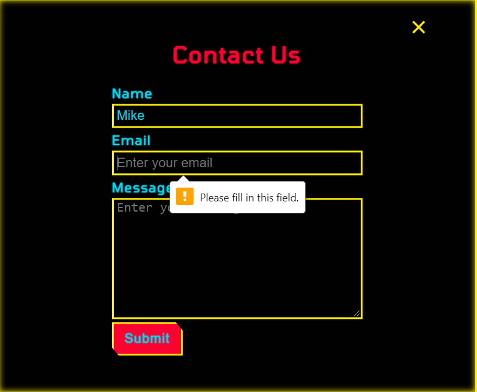
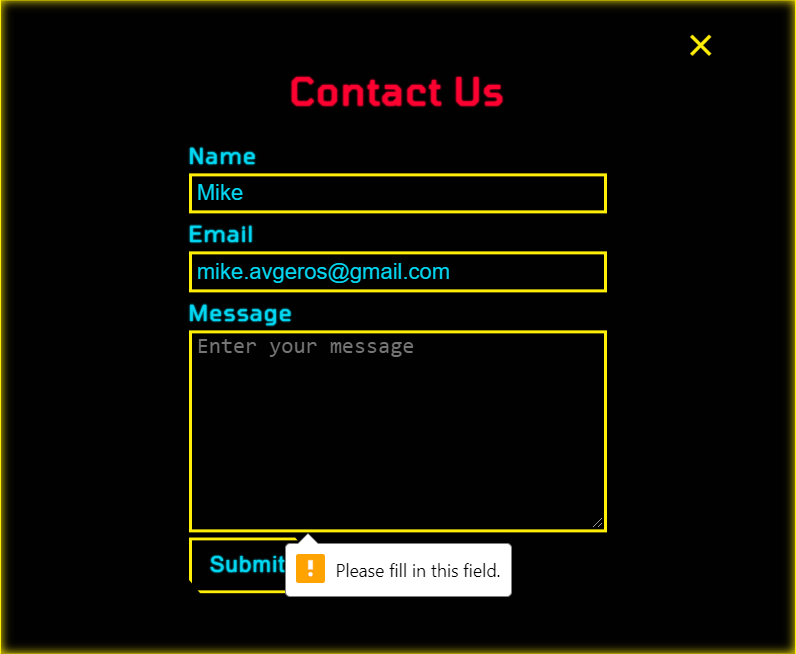
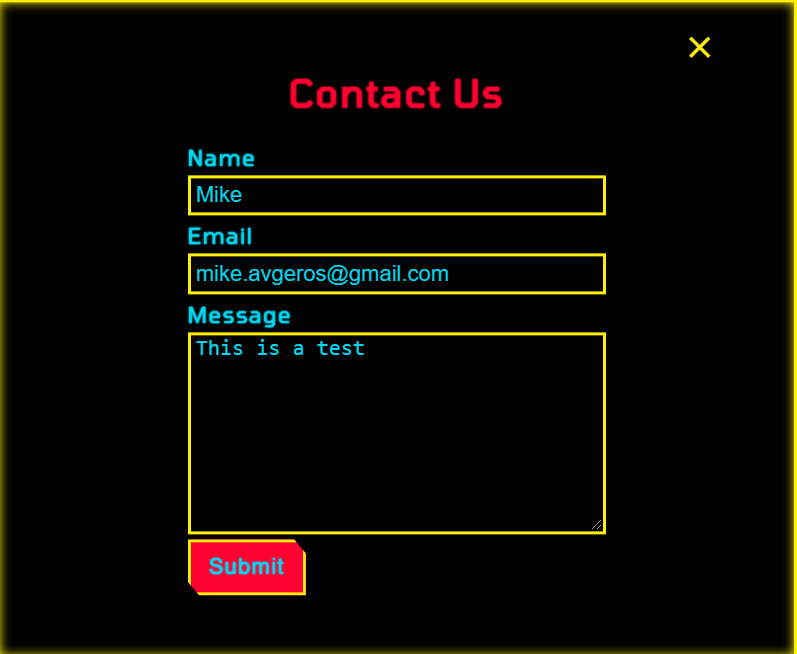
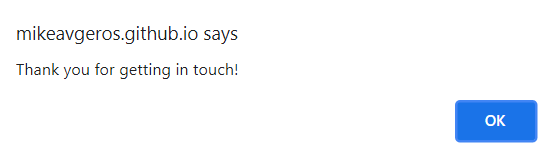
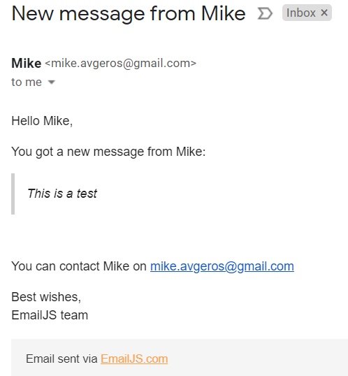

## Further Testing

-   The website was viewed and tested on a variety of devices such as Desktop, Laptop, iPad, and a variety of Android and iOs mobile phones.

-   A large amount of testing was done to ensure that all pages were linking correctly. 

-   All action buttons were carefully tested to ensure they were linking to the correct node or scene.

-   The story branches were carefully tested to ensure they don't create a loop.

-   Friends, family members and other Code Institute students were asked to review the site and documentation to point out any bugs, typos and/or user experience issues.

# Deployment

## Github Repository

The project was stored on Github using the following steps.

1.  I logged into my account on GitHub - [My account](https://github.com/MikeAvgeros)

2.  I created a public repository for my 2nd Milestone project - [Cyber Escape](https://github.com/MikeAvgeros/escape-game)

## Github Pages

The project was deployed to GitHub Pages using the following steps.

1.  I logged in to Github and located the [Github Repository](https://github.com/MikeAvgeros/escape-game)

2.  At the top of the Repository (not top of page), I clicked the "Settings" Button on the menu.

3.  I Scrolled down the Settings page until you locate the "GitHub Pages" Section.

4.  Under "Source", I clicked the dropdown called "None" and select "Master Branch".

5.  I scrolled back down through the page to locate the now published [site link](https://mikeavgeros.github.io/escape-game/) in the "GitHub Pages" section.

## Cloning the Github Repository

The Github repository was cloned and stored locally on my machine using the following steps. 

1.  I cloned my [Github Repository](https://github.com/MikeAvgeros/escape-game) using HTTPS, under "Clone with HTTPS", and copied the link.

2.  I opened [SourceTree](https://www.sourcetreeapp.com/), opened a new tab and clicked on the Clone icon. I pasted the HTTPS link and added a local directory in my machine.

3.  I opened [VS Code](https://code.visualstudio.com/), clicked on File/Open File and navigated to the local directory I had cloned my Github repository.

# Credits

## Images

I have used the following images from [Unsplash](https://unsplash.com/).

-   [Alexander Popov](https://unsplash.com/photos/3InMDrsuYrk)

-   [Alexander Popov](https://unsplash.com/photos/SLXreEd0Yu4)

-   [Lorenzo Herrera](https://unsplash.com/photos/p0j-mE6mGo4)

-   [Victor Rodriguez](https://unsplash.com/photos/UrfpprfDB0k)

-   [Taton Moïse](https://unsplash.com/photos/EhOCnW4wnuQ)

-   [Some Tale](https://unsplash.com/photos/m7K6cmWX4to)

-   [Recep Tiryaki](https://unsplash.com/photos/ToeuFHochZo)

-   [Valery Sysoev](https://unsplash.com/photos/2UPcVeOXOxc)

# Acknowledgements

-   I would like to thank my mentor, [Narender Singh](https://linkedin.com/in/nar3nd3r) for his support, guidance and design ideas.

-   I would like to thank the [Code Institute](https://codeinstitute.net/) for the well-thought-out curriculum and their amazing and super informative and helpful Slack community!

-   I would like to thank the Coding Novas group and everyone at the Full Stack Developers WhatsApp group for their helpful input during my testing phase.
